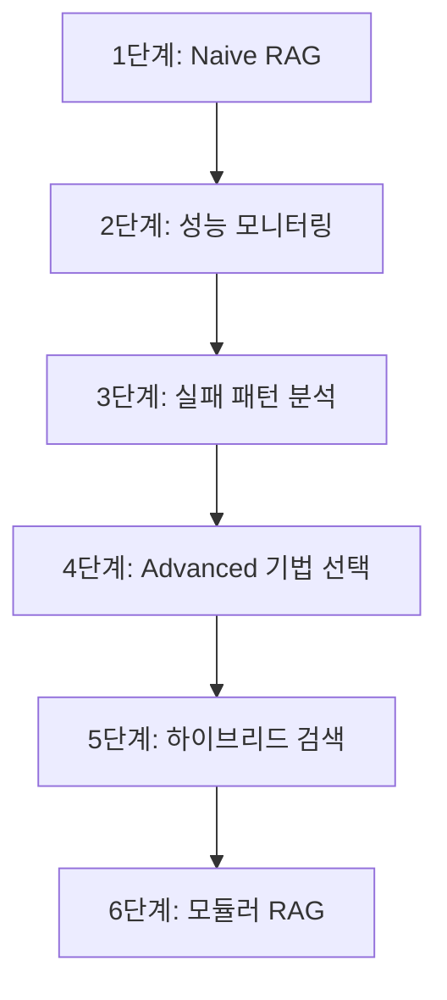

# Day 2 - Advanced RAG Systems: Naive → Advanced → Modular

## 🎯 과정 개요

이 과정은 RAG(Retrieval-Augmented Generation) 시스템을 단계적으로 발전시켜나가는 실습 중심 커리큘럼입니다. Naive RAG부터 시작하여 최신 Modular RAG까지, 실무에서 바로 적용 가능한 고급 기법들을 체계적으로 학습합니다.

### 📚 커리큘럼 구성

| 노트북 | 제목 | 시간 | 핵심 내용 |
|-------|------|------|----------|
| 00 | RAG 이론 개요 | 60분 | RAG 진화 과정, 최신 트렌드 |
| 01 | Naive RAG 베이스라인 | 60분 | 기본 RAG 파이프라인, 성능 측정 |
| 02 | 실패 사례 분석 | 60분 | 5가지 실패 패턴, 실시간 모니터링 |
| 03 | 고급 쿼리 개선 | 75분 | Multi-Query, Sub-Question, RAG-Fusion |
| 04 | 메타데이터 필터링 | 60분 | 시간/카테고리 기반 정밀 필터링 |
| 05 | 하이브리드 검색 | 75분 | BM25+Vector, RRF, Cross-encoder |
| 06 | 모듈러 RAG | 90분 | Query Router, Self-RAG, Adaptive Selection |
| 07 | 인터랙티브 비교 | 45분 | 통합 비교, 추천 시스템, 벤치마크 |

**총 학습 시간**: 525분 (8시간 45분)

## 🚀 시작하기

### 환경 설정

```bash
# 가상환경 생성 및 활성화
python -m venv rag-env
source rag-env/bin/activate  # Linux/Mac
# rag-env\Scripts\activate  # Windows

# 필수 패키지 설치
pip install -r requirements.txt
```

### 필수 패키지 목록

```
langchain==0.1.0
faiss-cpu==1.7.4
sentence-transformers==2.2.2
rank-bm25==0.2.2
matplotlib==3.7.2
seaborn==0.12.2
plotly==5.17.0
pandas==2.0.3
numpy==1.24.3
scikit-learn==1.3.0
ipywidgets==8.1.1
```

## 📖 노트북별 상세 가이드

### 00. RAG 이론 개요 (`00_day2_rag_theory.ipynb`)
**학습 목표**: RAG 시스템의 전체적인 진화 과정과 각 단계별 핵심 개념 이해

- **Naive RAG (20분)**: 기본 구조와 한계점
- **Advanced RAG (30분)**: Query Refinement, Metadata Filtering, Hybrid Search
- **Modular RAG (15분)**: 적응형 라우팅, Self-RAG, 프로덕션 고려사항

### 01. Naive RAG 베이스라인 (`01_naive_rag_baseline.ipynb`)
**학습 목표**: 기본 RAG 시스템 구축 및 성능 측정 시스템 구현

핵심 구현:
- FAISS 벡터 스토어 구축
- LangChain 기반 RAG 체인
- 성능 측정 대시보드
- 한글 지원 시각화

```python
# 핵심 코드 예시
class RAGPerformanceTracker:
    def measure_query_performance(self, rag_chain, query, expected_keywords):
        # 응답 시간, 키워드 커버리지, 컨텍스트 길이 측정
        pass
```

### 02. 실패 사례 분석 (`02_naive_failure_analysis.ipynb`)
**학습 목표**: Naive RAG의 구체적 실패 패턴 분석 및 모니터링 시스템 구축

5가지 주요 실패 패턴:
1. **의미적 차이 (Semantic Gap)**: 질문과 문서의 표현 방식 불일치
2. **컨텍스트 파편화**: 긴 내용의 청크 분할로 인한 맥락 손실
3. **모호한 질문**: 불명확한 질의로 인한 잘못된 검색
4. **오래된 정보**: 최신 정보 요구 vs 구 버전 문서
5. **낮은 관련성 순위**: 중요한 문서의 낮은 검색 순위

### 03. 고급 쿼리 개선 (`03_advanced_query_refinement.ipynb`)
**학습 목표**: 다양한 쿼리 개선 기법으로 검색 품질 향상

구현 기법:
- **Multi-Query Generation**: 다양한 관점의 쿼리 생성
- **Sub-Question Decomposition**: 복합 질문의 단계적 분해
- **Query Expansion**: 동의어/관련어 활용 검색 범위 확장
- **RAG-Fusion**: Reciprocal Rank Fusion으로 결과 통합

### 04. 메타데이터 필터링 (`04_metadata_filtering.ipynb`)
**학습 목표**: 정확한 문서 선별을 위한 메타데이터 기반 필터링

필터링 유형:
- **시간 기반**: 연도, 최신 기간별 문서 선별
- **카테고리 기반**: 도메인, 난이도별 분류
- **동적 선택**: 쿼리 의도 분석 기반 자동 필터 적용

### 05. 하이브리드 검색 (`05_hybrid_search_rerank.ipynb`)
**학습 목표**: 키워드와 의미 검색의 장점을 결합한 하이브리드 시스템

핵심 구성:
- **BM25 + Vector Search**: 키워드 정확도 + 의미적 유사성
- **Reciprocal Rank Fusion**: 순위 기반 결과 통합
- **Cross-encoder Re-ranking**: 정밀한 관련성 재평가
- **Multi-stage Pipeline**: 단계별 품질 향상

### 06. 모듈러 RAG (`06_modular_rag_routing.ipynb`)
**학습 목표**: 지능형 라우팅과 자가 검증 기능을 갖춘 모듈러 시스템

핵심 모듈:
- **Query Router**: 6가지 질문 유형 분류 및 전략 라우팅
- **Self-RAG**: 자가 검증으로 품질 보장
- **Adaptive Selection**: 성능 이력 기반 동적 전략 선택

### 07. 인터랙티브 비교 (`07_interactive_comparison.ipynb`)
**학습 목표**: 모든 RAG 방법의 종합 비교 및 맞춤형 추천

제공 기능:
- 통합 성능 벤치마크
- 사용자 맞춤형 추천 시스템
- 실시간 성능 비교 도구

## 🎯 실무 적용 가이드

### 단계별 구현 로드맵



### 상황별 최적 전략

| 상황 | 추천 방법 | 이유 |
|------|-----------|------|
| 🚀 빠른 프로토타이핑 | Naive RAG | 구현 간단, 빠른 결과 |
| 🎯 높은 정확도 필요 | Hybrid Search | 키워드+의미 검색 결합 |
| 💰 비용 최적화 | Multi-Query + Metadata | 효율적 성능 향상 |
| 🏭 프로덕션 환경 | Modular RAG | 자가 최적화, 확장성 |

## 📊 성능 벤치마크

| 방법 | 정확도 | 속도 | 비용 효율성 | 구현 복잡도 |
|------|--------|------|-------------|-------------|
| Naive RAG | 0.65 | 0.95 | 0.80 | 0.10 |
| Multi-Query | 0.75 | 0.70 | 0.60 | 0.30 |
| Hybrid Search | 0.90 | 0.50 | 0.30 | 0.70 |
| Modular RAG | 0.95 | 0.40 | 0.10 | 0.90 |

## 🛠️ 트러블슈팅

### 자주 발생하는 문제와 해결책

#### 1. 메모리 부족 오류
```python
# 해결책: 배치 크기 조정
embeddings = HuggingFaceEmbeddings(
    model_kwargs={'device': 'cpu'},
    encode_kwargs={'batch_size': 32}  # 기본값보다 작게
)
```

#### 2. 한글 처리 문제
```python
# 해결책: 적절한 토크나이저 사용
from langchain.text_splitter import RecursiveCharacterTextSplitter

text_splitter = RecursiveCharacterTextSplitter(
    chunk_size=500,
    chunk_overlap=50,
    separators=["\n\n", "\n", " ", ""]
)
```

#### 3. FAISS 인덱스 저장/로드
```python
# 저장
vector_store.save_local("faiss_index")

# 로드
vector_store = FAISS.load_local("faiss_index", embeddings)
```

## 🔧 확장 가이드

### 새로운 RAG 기법 추가

1. **기본 클래스 상속**
```python
class CustomRAGMethod(BaseRAGMethod):
    def search(self, query: str) -> List[Dict]:
        # 커스텀 로직 구현
        pass
```

2. **성능 측정 추가**
```python
performance_tracker.add_method("custom_method", CustomRAGMethod())
```

3. **비교 시스템에 등록**
```python
rag_comparison.register_method("custom", {
    "name": "Custom RAG",
    "description": "사용자 정의 RAG 방법"
})
```

## 📚 참고 자료

### 논문 및 아티클
- **RAG 원본 논문**: [Retrieval-Augmented Generation for Knowledge-Intensive NLP Tasks](https://arxiv.org/abs/2005.11401)
- **RAG-Fusion**: [RAG-Fusion: A New Take on Retrieval-Augmented Generation](https://arxiv.org/abs/2402.03367)
- **Self-RAG**: [Self-RAG: Learning to Retrieve, Generate and Critique through Self-reflection](https://arxiv.org/abs/2310.11511)

### 오픈소스 프로젝트
- [LangChain](https://github.com/langchain-ai/langchain): RAG 파이프라인 구축
- [LlamaIndex](https://github.com/run-llama/llama_index): 고급 RAG 기능
- [FAISS](https://github.com/facebookresearch/faiss): 벡터 검색 엔진

## 🤝 기여하기

이 커리큘럼의 개선사항이나 새로운 기법 추가를 원하시면:

1. Issues에 제안사항 등록
2. Pull Request 제출
3. 실습 결과 공유

## 📞 지원

- **문의**: 실습 중 문제가 발생하면 Issues에 등록해주세요
- **피드백**: 개선사항이나 추가 희망 내용을 알려주세요
- **커뮤니티**: 다른 학습자들과 경험을 공유하세요

---

**🎉 Day 2 RAG 마스터 과정을 완주하여 RAG 전문가가 되어보세요!**

*이 커리큘럼은 최신 RAG 연구와 실무 경험을 바탕으로 지속적으로 업데이트됩니다.*